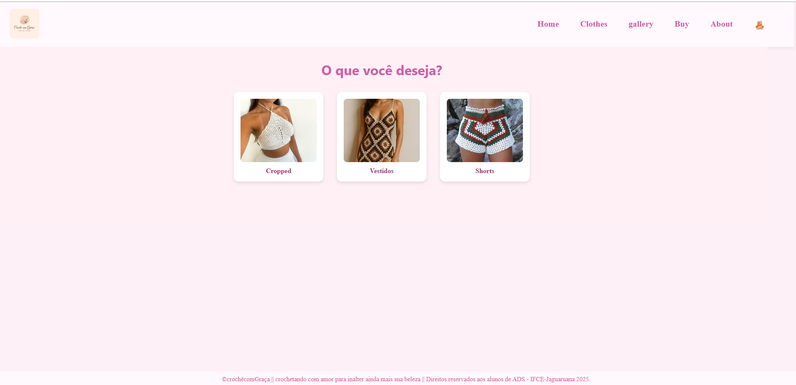
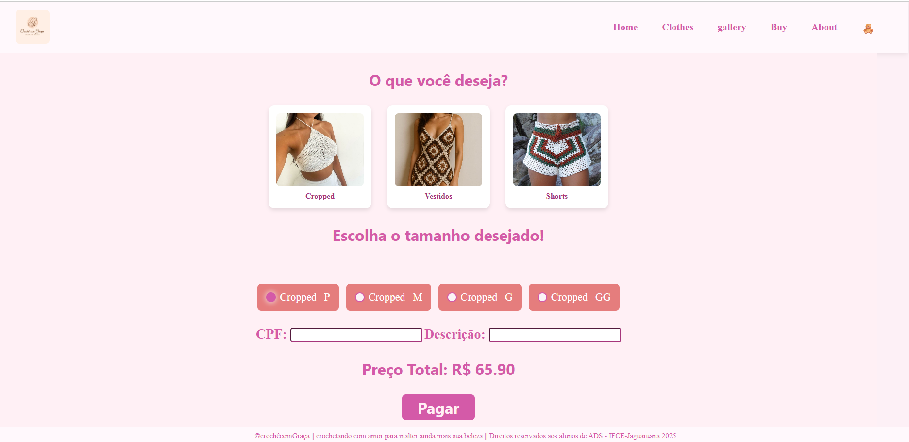

# Projeto Crochê Com Graça

O projeto apresenta uma pequena apresentação do sistema de loja, oferecendo modelos, tamanhos e valores de alguma peças feita pela proprietária, peças de vestuário como, cropped, vestidos e shorts, dando ao usuário a possibilidade de escolher diversas opções. O sistema será uma aplicação fullstack com back-end, front-end e banco de dados (postgres).

## Design do Projeto


Página de informações


## Como executar a parte do Back-end do projeto

1. Clonar o projeto ou baixar os arquivo para a sua máquina.
2. Instalar as dependências executando o comando abaixo dentro da pasta Back-end:

```
npm i
```

3. Executar o servidor (Back-end) com o comando:

```
npm run dev
```
## EndPoints Utilizada do projeto
**Exemplo de EndPoint** `` http://localhost:8080/roupas/``

**Resposta do EndPoint**
```json
[
  {
    "id": 30,
    "nome": "Short"
  },
  {
    "id": 10,
    "nome": "Cropped"
  },
  {
    "id": 20,
    "nome": "Vestido"
  }
]
```
**Exemplo de EndPoint** `` http://localhost:8080/roupa/10``

**Resposta do EndPoint**
```json
{
  "roupa": [
    {
      "nome": "Cropped",
      "tamanho": "P",
      "preco": 65.9
    },
    {
      "nome": "Cropped",
      "tamanho": "M",
      "preco": 79.9
    },
    {
      "nome": "Cropped",
      "tamanho": "G",
      "preco": 99.9
    },
    {
      "nome": "Cropped",
      "tamanho": "GG",
      "preco": 139.9
    }
  ]
}
```
**Exemplo de EndPoint** `` http://localhost:8080/historico``

**Resposta do EndPoint**
```json
[
 {
    "id": 1,
    "cpf": "06050714380",
    "descricao": "gduytegshduhsgeufygakhdfbuakeygf",
    "precototal": 139.9,
    "datacompra": "2025-06-22T03:00:00.000Z"
  }
]
```
## Funcionalidades
- [x] Imagens das peças
- [x] Mostrar os tamanhos
- [x] Mostrar os valores
- [x] Descrição informada pelo usuário 
- [ ] Responsividade

## Observações
> [!Note]
> Projeto feito na disciplina de programação web I do curso ADS de ifce de Jaguaruana.

>[!IMPORTANT]
> Alguns peças ainda estão em desenvolvimento, ou pode ocorrer de não carregar as imagens.


## Contatos
- Email: ana.paula.silva06@aluno.ifce.edu.br
-LinkedIn: https://www.linkedin.com/in/ana-paula-silva-lopes-7408b0363/